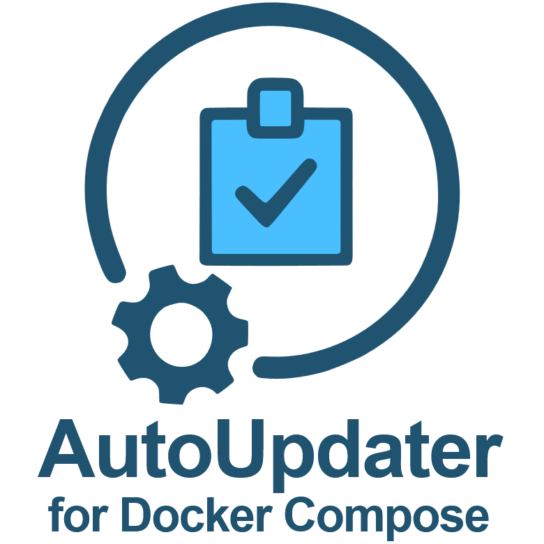

<div align="center">
  

---

A lightweight Python utility that automatically detects and updates Docker Compose services when new image versions are available in the registry!
</div>

## ⚠️ SECURITY WARNING

> [!WARNING]
> **Docker socket = root access to your entire Docker environment**
> 
> This tool can control ALL containers. A compromise means full system access.
> Review [Security Considerations](#️-security-considerations) before installing.

## 🚀 Features

- **Automatic digest comparison**: Detects outdated images by comparing local vs. remote SHA256 digests
- **Compose-aware**: Works with Docker Compose containers (validates via Compose labels)
- **Cron scheduling**: Automated updates on your schedule (daily, hourly, custom)
- **Flexible update modes**: All labeled, single container, or force mode
- **Image cleanup**: Optionally remove old/dangling images after updates
- **State preservation**: Respects container running state during updates
- **Containerized**: Runs as a Docker container with access to host Docker daemon

## 📋 Table of Contents

- [Security Considerations](#-security-considerations)
- [Installation](#installation)
  - [Option 1: Standalone Script](#option-1-standalone-script)
  - [Option 2: Docker Container (Recommended)](#option-2-docker-container-recommended)
- [Usage](#-usage)
  - [Standalone Mode](#standalone-mode)
  - [Container Mode](#container-mode)
- [Configuration](#%EF%B8%8F-configuration)
- [Docker Compose Setup Example](#-docker-compose-setup-example)
- [How It Works](#-how-it-works)

---

## ⚠️ Security Considerations

**IMPORTANT: Read this before installing!**

### What It Needs
- The service needs access to the Docker socket (`/var/run/docker.sock`)
- **Container mode**: Runs as root inside container (isolated from host)
- **Standalone mode**: User must be in the `docker` group (non-root)

### Security Implications

- The autoupdate container has full control over Docker daemon
- Use registry credentials via Docker config for private registries
- Recommend mounting compose directories as read-only (`:ro`)
- Always test in development before production use

### Security Best Practices

1. **Don't auto-update critical services**: Exclude databases and stateful services from auto-updates
2. **Use specific tags**: Prefer `nginx:1` over `nginx:latest` for more control
3. **Monitor logs**: Regularly check update logs for issues
4. **Test first**: Use `RUN_ON_STARTUP=true` to test immediately
5. **Backup**: Always backup before enabling auto-updates on production


## 📥 Installation

### Option 1: Standalone Script

```bash
# Clone the repository
git clone https://github.com/buspo/autoUpdater.git
cd autoUpdater

# Create virtual environment and install dependencies
python3 -m venv .venv
source .venv/bin/activate
pip install -r requirements.txt
```

### Option 2: Docker Container (Recommended)

```bash
# Clone the repository
git clone https://github.com/buspo/autoUpdater.git
cd autoUpdater

# Edit docker-compose.yml to configure your paths
# See "Configuration" section below

# Build and start
docker compose build
docker compose up -d

# View logs
docker compose logs
```

---

## 🎯 Usage

### Standalone Mode
The standalone model does not have an automatic start and must be configured manually

#### Basic Commands

```bash
# Update all containers with default label
python3 autoupdate.py

# Update a specific container
python3 autoupdate.py --update myapp

# Update and cleanup old images
python3 autoupdate.py --cleanup

# Show all options
python3 autoupdate.py --help
```

#### Arguments Reference

| Argument | Default | Description |
|----------|---------|-------------|
| `--label LABEL` | `autoupdate.enable=true` | Label filter to identify containers for update |
| `--update CONTAINER` | `None` | Update only the specified container name |
| `--force` | `False` | Force update bypassing label and digest checks |
| `--cleanup` | `False` | Remove old/dangling images after update |

#### Examples

```bash
# Update all labeled containers and cleanup
python3 autoupdate.py --cleanup

# Update only one container
python3 autoupdate.py --update web

# Force update without label check
python3 autoupdate.py --update app --force

# Use custom label
python3 autoupdate.py --label "myapp.autoupdate=enabled"

# Force update all (requires confirmation)
python3 autoupdate.py --force
```

### Container Mode

The containerized version runs automatically on a cron schedule.

#### Direct Docker Commands

If you prefer not using the commands.sh script:

```bash
# Build
docker-compose build

# Start
docker-compose up -d

# Logs
docker-compose logs -f

# Stop
docker-compose down

# Run update now
docker exec -it docker-autoupdate bash -c 'source /app/entrypoint.sh && run_update'

# Check status
docker ps --filter name=docker-autoupdate

# View configuration
docker exec docker-autoupdate env | grep -E "CRON|LABEL|CLEANUP"
```

---

## ⚙️ Configuration

### Container Configuration

Edit `docker-compose.yml` to customize:

#### 1. Mount your Docker Compose directories

```yaml
volumes:
  - /var/run/docker.sock:/var/run/docker.sock                   # Required
  - $HOME/.docker/config.json:/root/.docker/config.json:ro      # For private registries
  - /opt/docker:/opt/docker:ro                                  # Your compose files
  - /home/user/projects:/projects:ro                            # Add more as needed
```

#### 2. Configure environment variables

```yaml
environment:
  # When to run (cron format)
  - CRON_SCHEDULE=0 3 * * *  # Daily at 3 AM
  
  # Which label to look for
  - AUTOUPDATE_LABEL=autoupdate.enable=true
  
  # Cleanup old images
  - AUTO_CLEANUP=true
  
  # Force update all
  - FORCE_UPDATE=false
  
  # Run on startup
  - RUN_ON_STARTUP=false
  
  # Timezone
  - TZ=Europe/Rome
```

---

## 🐳 Docker Compose Setup Example

Label your services to enable auto-updates:

```yaml
services:
  # Web application - will be auto-updated
  web:
    image: nginx:latest
    labels:
      - autoupdate.enable=true  # ← Enable auto-update
    ports:
      - "80:80"
    restart: unless-stopped

  # Application server - will be auto-updated
  app:
    image: myapp:latest
    labels:
      - autoupdate.enable=true  # ← Enable auto-update
    environment:
      - ENV=production
    restart: unless-stopped
      
  # Database - NOT auto-updated (no label)
  database:
    image: postgres:15
    # No autoupdate label - this is intentional!
    # Databases should be updated manually
    volumes:
      - db-data:/var/lib/postgresql/data
    restart: unless-stopped

  # Auto-updater service
  autoupdate:
    image: docker-autoupdate:latest
    volumes:
      - /var/run/docker.sock:/var/run/docker.sock
      - /opt/docker:/opt/docker:ro
    environment:
      - CRON_SCHEDULE=0 3 * * *  # Daily at 3 AM
      - AUTO_CLEANUP=true
    restart: unless-stopped
    labels:
      # Label to identify self container and skip updates
      - autoupdater.self=true
      - autoupdate.enable=false
```

Then start your stack:

```bash
docker-compose up -d
```

The autoupdate service will:
- Run immediately on startup (if RUN_ON_STARTUP=true)
- Then run on the configured cron schedule
- Update only services with the label
- Preserve running state of containers
- Optionally cleanup old images

---

## 🔄 How It Works

```
1. Scan Docker containers for Compose metadata labels
2. For each labeled (or specified) container:
   ├─ Retrieve the local image's RepoDigest (SHA256)
   ├─ Query the registry for the remote digest
   └─ Compare digests to detect if update is available
3. If update needed:
   ├─ Pull the new image from registry
   ├─ Run `docker compose up -d --build` (if was running)
   │  OR `docker compose up --no-start` (if was stopped)
   └─ Optionally cleanup the old image (if AUTO_CLEANUP=true)
4. Log all actions with timestamps
```

### Container State Preservation

- **Running containers**: Pulled, rebuilt, and restarted
- **Stopped containers**: Image updated but container remains stopped
- **Labels respected**: Only updates containers with the configured label (unless --force)

---